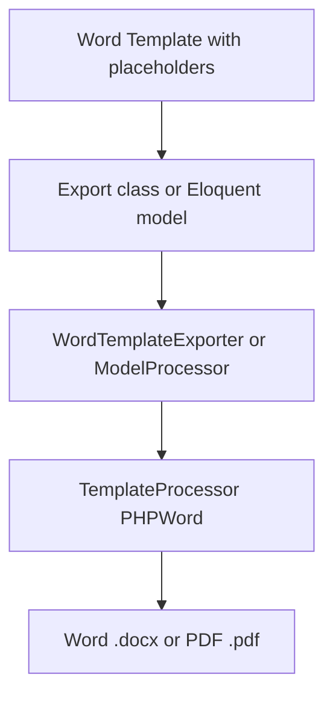

# Word Template Exporter

A Laravel package for exporting Word templates with placeholders as `.docx` or `.pdf` files. Placeholders (e.g. `${variable}`, `${block}...${/block}`) are filled with data from export classes, Eloquent models, or collections.

## Features

- **Word template processing**: Placeholders in Word templates are replaced with your data.
- **Export formats**: `.docx` (Word) and `.pdf` (via LibreOffice).
- **Data sources**: Export classes implementing concerns/interfaces, or Eloquent models with the Exportable trait.
- **Extended features**: Charts, images, tables, checkboxes.
- **Relations**: Automatic loading and processing of Eloquent relations based on template placeholders.

## Tech Stack

- **PHPWord** (`phpoffice/phpword`): Template processing and Word file generation.
- **LibreOffice**: PDF conversion via the `soffice` command.
- **Laravel**: Service provider, facades, Eloquent builder extensions, queue jobs.

## Architecture

### Data Flow

1. **Word template** (with placeholders) is loaded.
2. **Export class** (with concerns) or **Eloquent model** (with Exportable trait) provides data.
3. **WordTemplateExporter** or **ModelProcessor** coordinates processing.
4. **TemplateProcessor** (PHPWord) replaces placeholders and handles blocks.
5. Output is a **Word file** (`.docx`) or **PDF** (via LibreOffice).

### Package Structure

| Directory | Purpose |
|-----------|---------|
| `Concerns/` | Interfaces for export classes (FromWordTemplate, GlobalTokens, WithCharts, etc.) |
| `Processor/` | WordTemplateExporter, ModelProcessor, TemplateProcessor, Exporter, PDFExporter |
| `Eloquent/` | Builder extensions for models |
| `Jobs/` | Batch export and Word-to-PDF queue jobs |
| `Facade/` | WordExport facade |
| `Traits/` | Exportable trait for models |
| `Commands/` | `make:word` Artisan command |

## Usage Paths

1. **Export classes** (recommended): Implement `FromWordTemplate` and optional concerns; use the `WordExport` facade.
2. **Exportable trait** (deprecated): Use the trait on models and call `->template()->export()` on the builder. See [Exportable (Deprecated)](exportable-deprecated.md).

Start with [Installation](installation.md) and [Quick Start](quickstart.md).
